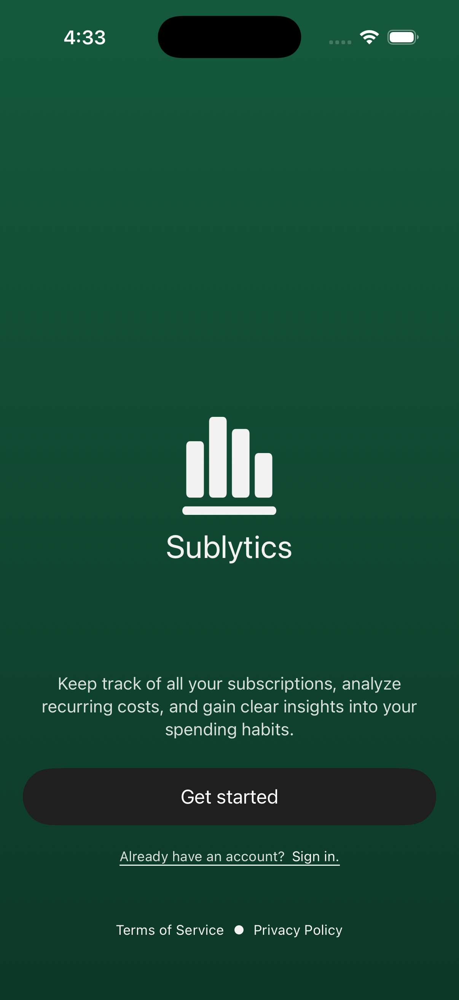
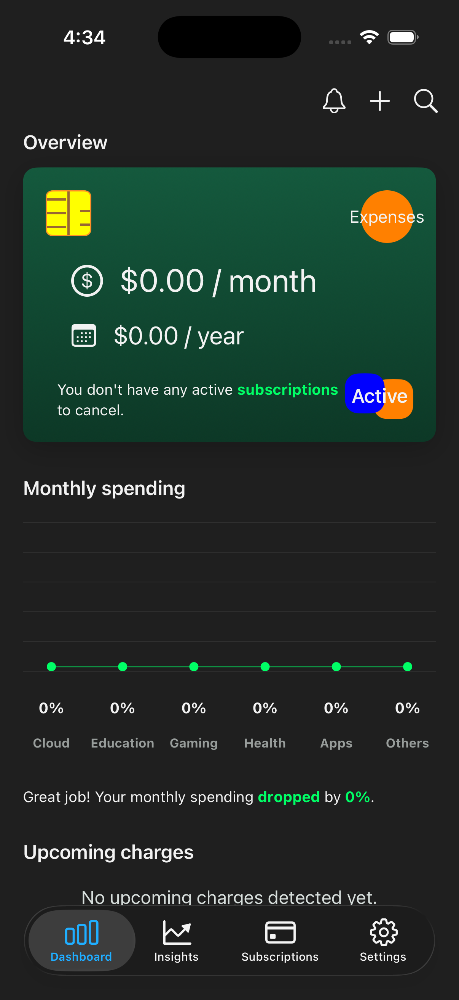
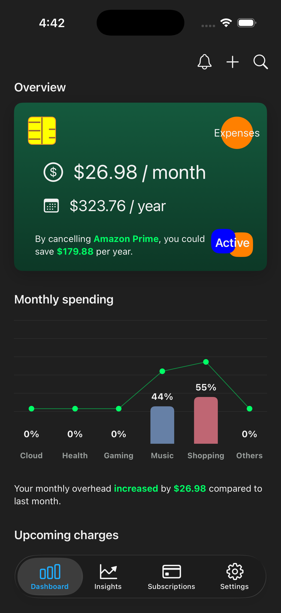
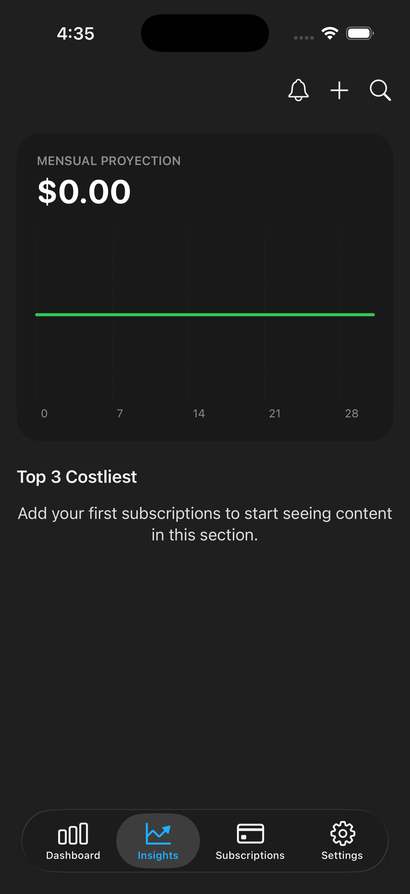
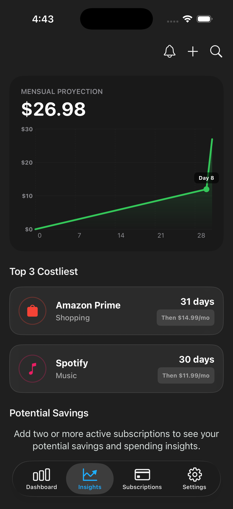
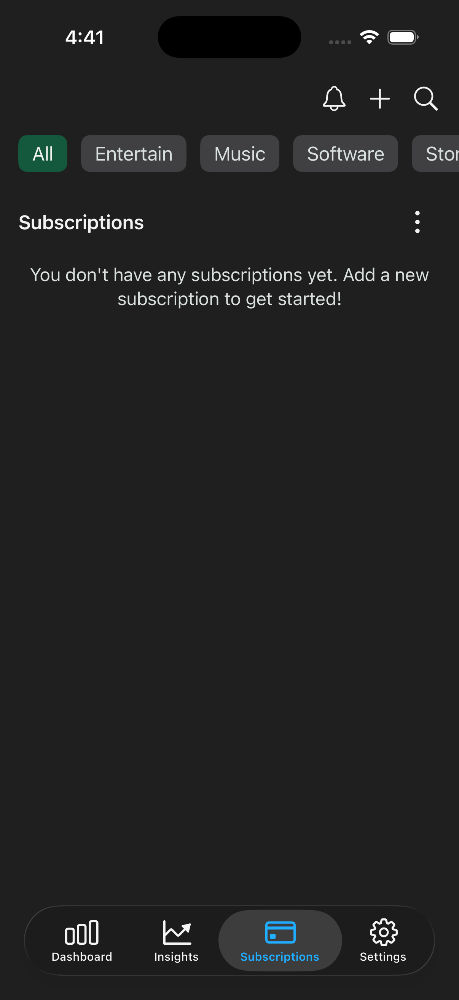
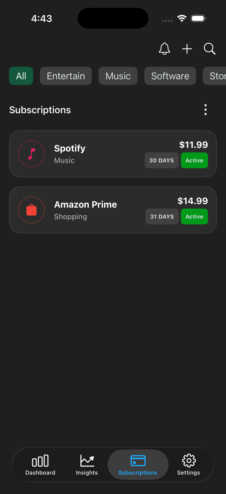
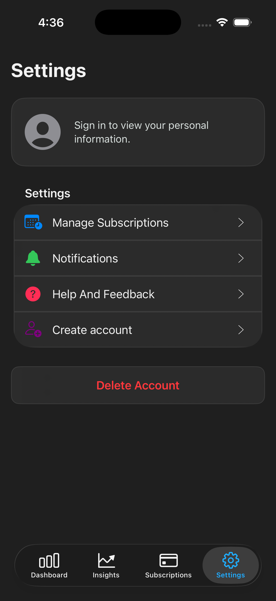
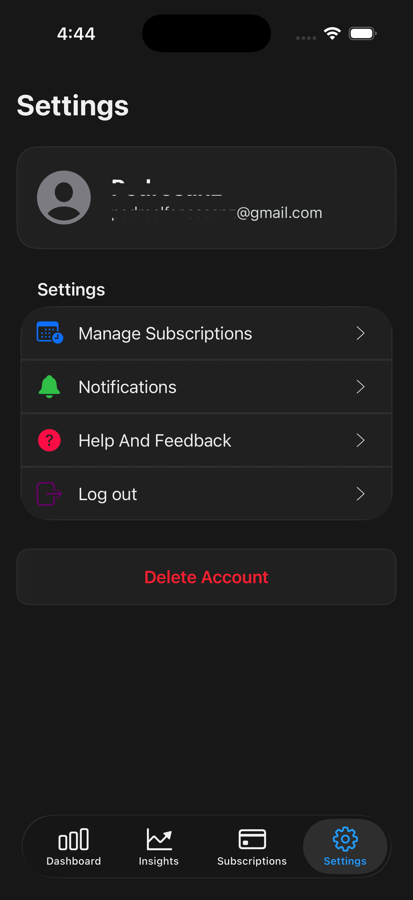
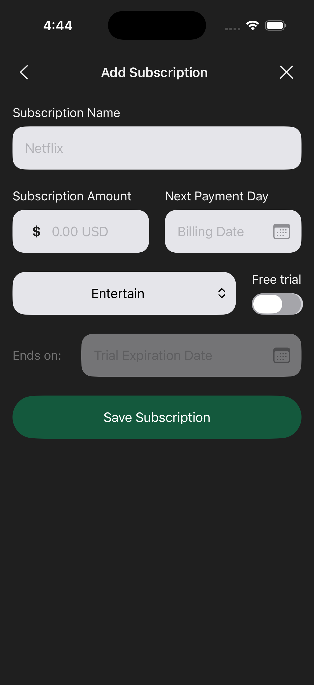

# 📊 Sublytics - Subscription & Expense Tracker - UIKit

## 📱 About the Project

**Sublytics** is a native iOS application built with **UIKit** designed to help users track, analyze, and manage recurring subscriptions and expense schedules efficiently.

## 🛠 Tech Stack

- Swift 6
- UIKit Framework
- MVVM Architecture + Protocol-Oriented Programming
- Concurrency
- Firebase Authentication
- Cloud Firestore
- Dependency Injection
- Local Persistence

## ✨ Features

- Total monthly/annual spend calculation and category percentage breakdown chart
- Forecasted monthly expenses, payment timeline, and top 3 highest costs
- Full real-time CRUD with filtering by status and category
- Automatic section for subscriptions renewing within 10 days
- Anonymous login on launch with optional Google Sign-In linking
- Profile management, sign-out, and account deletion
- Saved search history, onboarding flags, and session state

## 🧠 Architecture

- **MVVM:** Clear decoupling of UIKit views, state, and business logic
- **Protocol-Driven:** Swappable Mock and Real service implementations
- **Modern Concurrency:** Swift `async/await` for async workflows
- **Real-Time Data & Auth:** Live Firestore and Firebase Auth state listeners
- **State Management:** In-memory Data Manager and local session caching

## 📚 Key Learnings

- Swappable Mock and Firestore services for testing vs production
- Live state handling using Firestore and Firebase Auth listeners
- Asynchronous data workflows with Swift `async/await`
- Dynamic, data-driven interfaces without third-party frameworks
- Anonymous user flows seamlessly upgraded to Google Sign-In

## 🚀 Getting Started

Follow these steps to clone and run the application in your local development environment.

### Prerequisites

* **macOS** (latest version recommended)
* **Xcode** 15.0 or higher
* **iOS** 17.0+ deployment target
* A [Firebase Console](https://console.firebase.google.com/) account

To link your own Firebase instance:

- Go to the Firebase Console and create a project.
- Register an iOS app using the Bundle Identifier of this project.
- Download the GoogleService-Info.plist file.
- Drag and drop the file directly into the root folder inside Xcode (ensure Copy items if needed is checked and it is target-assigned to the main app target).

## 📱 Screenshots
### Welcome Screen

  

Displays the initial screen on app launch, where the user can sign in or enter the app without requiring a login.

### Dashboard Screen

  
  &nbsp;&nbsp;&nbsp;&nbsp;
  

Main dashboard displaying monthly and annual spending overviews, a category breakdown chart with percentage shares, and upcoming subscription renewals.

### Insights Screen

  
  &nbsp;&nbsp;&nbsp;&nbsp;
  

Monthly chart projection displaying total spending, upcoming charge dates, and the top 3 most expensive subscriptions.

### Subscriptions Screen

  
  &nbsp;&nbsp;&nbsp;&nbsp;
  

Subscription list categorized by status (active, canceled, or free) with an upcoming expiration section and category filtering.

### Settings Screen

  
  &nbsp;&nbsp;&nbsp;&nbsp;
  

Settings view displaying account details (username, email) with options to edit profile, log in, sign up, log out, or delete the account based on authentication status.

### Add & Edit Subscription Screen

  
  &nbsp;&nbsp;&nbsp;&nbsp;
  

Add and edit subscription views to create or update subscription details including name, cost, category, billing cycle, and renewal date.

### Search Subscription Screen

  <!--  -->

Search view allowing users to quickly find subscriptions by name or category, with support for saving recent search history.
